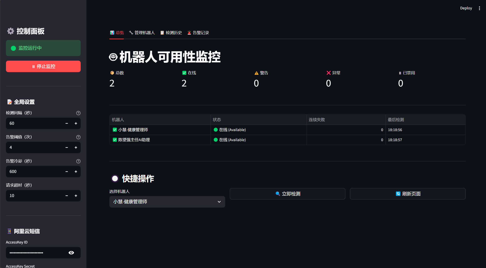
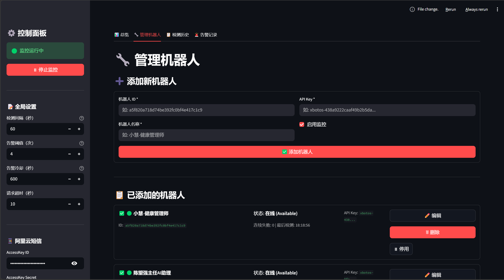
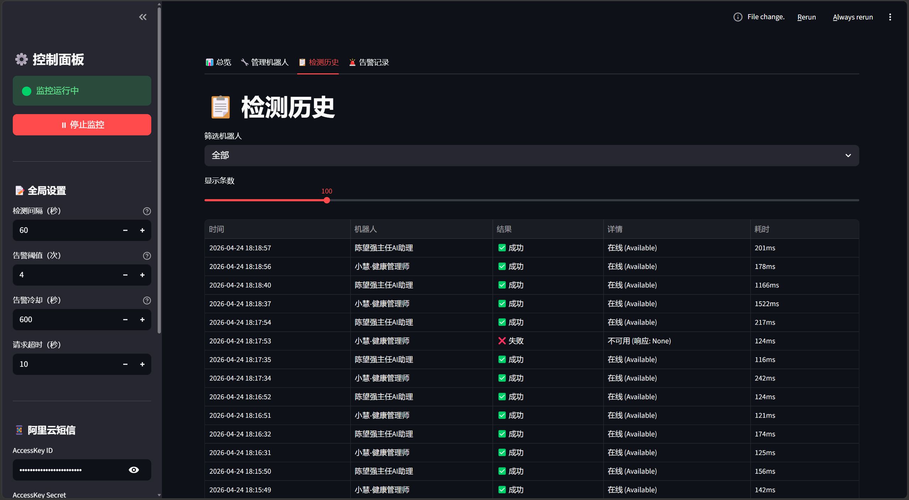

# 🤖 xbotos 机器人监控系统

基于 Streamlit 的 xbotos 机器人在线状态监控平台，支持阿里云短信告警，提供实时状态监控、历史数据追踪和智能告警功能。

## ✨ 功能特性

- **实时监控** — 定时检测机器人在线状态，自动刷新数据
- **连续失败告警** — 连续 N 次失败后才发送短信，避免误报
- **短信通知** — 通过阿里云短信推送告警信息
- **Web 界面** — 提供总览、管理、历史、告警四个功能面板
- **Docker 部署** — 支持 Docker / Docker Compose 一键部署
- **数据持久化** — 本地 JSON 存储，数据不丢失

## 📸 界面预览

### 总览面板



### 机器人管理



### 检测历史



## 🚀 快速开始

### 本地运行

```bash
cd xbotos-monitor
pip install -r requirements.txt
streamlit run app.py
```

访问 http://localhost:8501

### Docker 部署

#### 方式一：Docker Compose（推荐）

```bash
docker compose up -d
```

#### 方式二：Docker 命令

```bash
# 构建镜像
docker build -t robot-monitor .

# 运行容器
docker run -d \
  --name robot-monitor \
  --restart unless-stopped \
  -p 8501:8501 \
  -v $(pwd)/data:/app/data \
  -v $(pwd)/config.json:/app/config.json \
  -e TZ=Asia/Shanghai \
  robot-monitor
```

#### 环境变量配置

可以通过环境变量配置阿里云短信服务：

```bash
ALIYUN_ACCESS_KEY_ID=your_access_key_id
ALIYUN_ACCESS_KEY_SECRET=your_access_key_secret
ALIYUN_SMS_SIGN_NAME=机器人监控
ALIYUN_SMS_TEMPLATE_CODE=SMS_XXXXXXX
ALIYUN_SMS_PHONE_NUMBERS=13800138000
```

#### 1Panel 部署

1. 将项目文件夹上传到服务器
2. 在 1Panel 中创建 Docker Compose 项目，指向 `docker-compose.yml`
3. 配置环境变量（短信 AccessKey 等）
4. 启动容器，访问 `http://服务器IP:8501`

## 📁 项目结构

```
check_robot_status/
├── app.py              # Streamlit 主界面
├── requirements.txt    # Python 依赖
├── Dockerfile          # Docker 镜像
├── docker-compose.yml  # 部署配置
├── config.json         # 全局配置（自动生成）
├── .env.example        # 环境变量模板
├── README.md           # 说明文档
├── data/               # 数据存储目录
│   ├── robots.json     # 机器人配置
│   ├── history.json    # 检测历史
│   └── alerts.json     # 告警记录
└── src/
    ├── config.py       # 配置管理
    ├── data.py         # 数据读写
    ├── monitor.py      # 监控引擎
    └── alert.py        # 短信告警
```

## ⚙️ 配置说明

### config.json

```json
{
  "check_interval": 60,
  "consecutive_fail_threshold": 3,
  "alert_cooldown_seconds": 600,
  "request_timeout": 10,
  "api_base_url": "https://www.xbotos.com/center-api/robot/common/info/isAvailable",
  "aliyun_sms": {
    "access_key_id": "",
    "access_key_secret": "",
    "sign_name": "机器人监控",
    "template_code": "SMS_XXXXXXX",
    "phone_numbers": ["13800138000"]
  }
}
```

### 配置项说明

| 配置项 | 说明 | 默认值 |
|--------|------|--------|
| `check_interval` | 检测间隔（秒） | 60 |
| `consecutive_fail_threshold` | 连续失败告警阈值 | 3 |
| `alert_cooldown_seconds` | 告警冷却时间（秒） | 600 |
| `request_timeout` | 请求超时（秒） | 10 |

### 阿里云短信模板变量

短信模板需要包含以下变量：
- `{robot_name}` — 机器人名称
- `{fail_count}` — 连续失败次数

## 🛠️ 技术栈

- **前端框架**: Streamlit
- **数据处理**: Pandas
- **HTTP 请求**: Requests
- **短信服务**: 阿里云短信 SDK
- **部署**: Docker / Docker Compose

